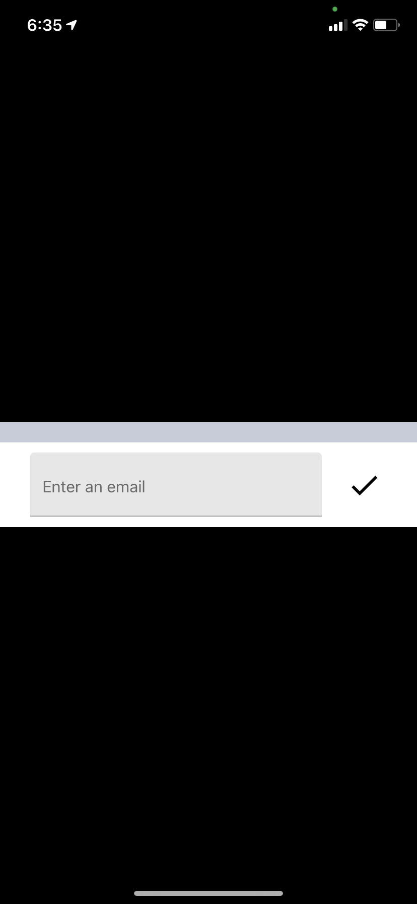
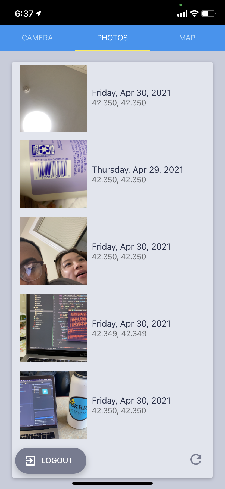
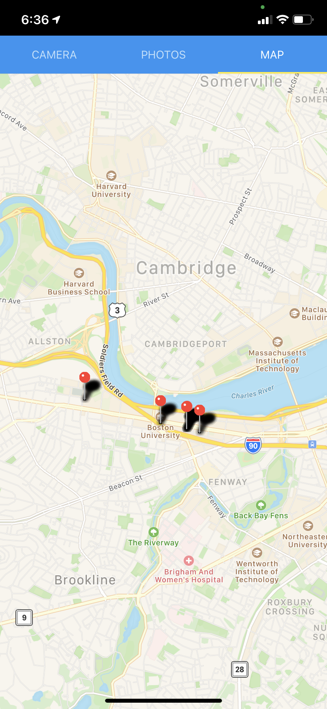

# EC 500 A2 Camera App
## Camera App

<!-- ABOUT THE PROJECT -->
## About The Project
This is a camera application that allows users to take pictures of items, scan the barcodes, and display the locations of where these pictures were taken on a map.

### Built With
* [React Native](https://reactnative.dev/)
* [React Native Maps](https://github.com/react-native-maps/react-native-maps)
* [React Native Paper](https://callstack.github.io/react-native-paper/index.html)
* [Expo SDK](https://docs.expo.io/versions/latest/)
* [Firebase](https://firebase.google.com)

<!-- GETTING STARTED -->
## Getting Started

### Prerequisites

Install the latest version of npm
* npm
  ```sh
  npm install npm@latest -g
  ```

### Installation

1. Setup Firebase Firestore at [https://firebase.google.com/docs/firestore](https://firebase.google.com/docs/firestore)
2. Clone the repo
   ```sh
   git clone https://github.com/BUEC500C1/camera-app-d-philip.git
   ```
3. Install NPM packages
   ```sh
   npm install
   ```
4. Enter your Firebase config keys in `app.json` as shown [here](https://docs.expo.io/guides/setup-native-firebase/)
5. Start the Expo project
   ```sh
   expo start
   ```


## Usage
### Screenshots
Login Page  


Camera Page  


Photos Page  


Map Page  

